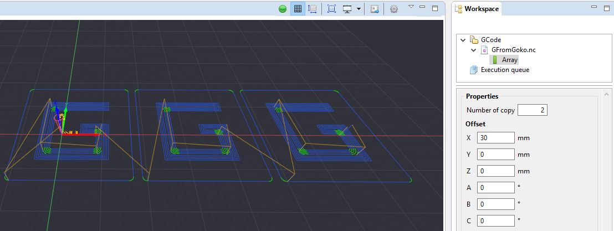

.. _gcode_modifiers:

Modifiers
=========

Modifiers are a convenient way to apply modifications to your GCode.
The modifiers you apply to an object are stored in a stack. By navigating up and down the stack, you can change the effect of the modifier.

 Example : effects of the array modifier

General considerations about modifiers :
 - unlimited number of modifiers can be added to a GCode program,
 - modifiers do not modify the original GCode file, and can be updated or deleted at any time,
 - the order of modifiers in the stack is important. Each modifier affects those that come after it.

.. note:: Some modifier have restrictions regarding the target GCode. For instance, Rotation modifier has a restricted set of option on GCode containing arcs, where arc are only defined in the XY, XZ or YZ planes.
