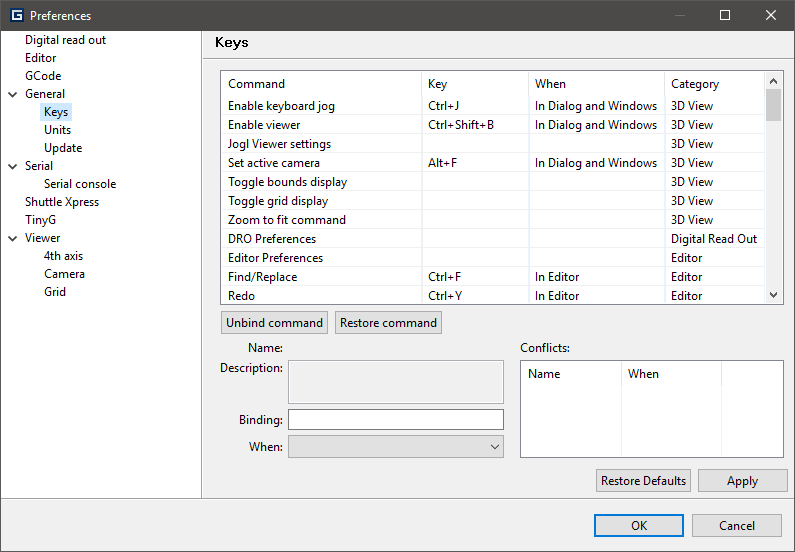

General
=======

:Target board: configure the you want to control. A restart is required for this setting to take effect.

Keys
^^^^

This panel allows you to specify your favorite key binding for Goko commands.

Each command can be associated with a key sequence, and a context (`When` column).

For instance, the Find/Replace command, associated with the key sequence :kbd:`Ctrl + F` in the `In editor` context, will only execute when :kbd:`Ctrl + F` is pressed in the GCode editor view.

 :Name: the name of the command,
 :Description: quick description of the command *(read only)*,
 :Binding: the actual key sequence. To change it, simply press the key sequence you want to use. The corresponding modifiers (Alt, Shift, etc...) will be automatically caught,
 :When: the context where this key sequence will trigger the action.

.. note:: It is **not** possible to have 2 commands with the same Binding in the same context.

Units
^^^^^

:Length: Select the unit used to display length units in Goko UI.
:Digits: the number of digit to display after the decimal separator for decimal values

.. note:: These settings do not affect any unit setting in your machine board configuration.

Update
^^^^^^

This panel allows you to activate or deactivate the automatic check for updates at startup, and changes its frequency.
