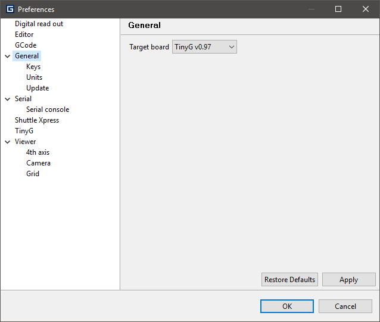

.. _preferences:

Preferences
===========

By using the :menuselection:`Windows --> Preferences` you can configure the application just the way you want.

----

.. toctree::
	:maxdepth: 2

	preferences-general
	preferences-viewer
