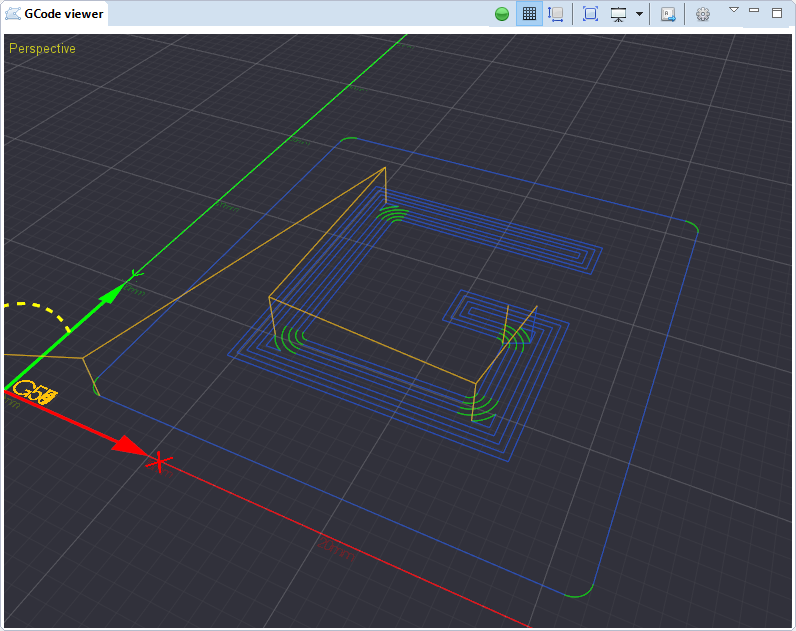

.. |mwb| image:: images/mouse_select_scroll.png

.. |tb-activated| image:: images/toolbar/viewer/activated.png

.. |tb-settings| image:: images/toolbar/gear.png

3D Preview
==========

This part provides a 3D preview of the GCode programs in the workspace and in the execution queue.

Toolbar
^^^^^^^

  +-----------------+-----------------------------------------------------------------------------------+
  | |tb-activated|  +  Activate viewer *(visible when disabled)*                                        +
  +-----------------+-----------------------------------------------------------------------------------+
  | |tb-deactivated|+  Disable viewer *(visible when active)*                                           +
  +-----------------+-----------------------------------------------------------------------------------+
  | |tb-grid|       +  Toggle grid visibility                                                           +
  +-----------------+-----------------------------------------------------------------------------------+
  | |tb-bounds|     +  Toggle GCode bound visibility                                                    +
  +-----------------+-----------------------------------------------------------------------------------+
  | |tb-zoom-fit|   +  Zoom to fit existing GCode in view                                               +
  +-----------------+-----------------------------------------------------------------------------------+
  | |tb-view|       +  View switch selector                                                             +
  +-----------------+-----------------------------------------------------------------------------------+
  | |tb-kbd-jog|    +  Activate keyboard jog                                                            +
  +-----------------+-----------------------------------------------------------------------------------+
  | |tb-settings|   +  Open viewer settings panel                                                       +
  +-----------------+-----------------------------------------------------------------------------------+

Controls
^^^^^^^^

Mouse
#####

  +---------+---------------------------------------------------------------+
  | |lmb|   +  Pan move of the view                                         +
  +---------+---------------------------------------------------------------+
  | |rmb|   +  Orbit around the center of the view *(Perspective view only)*+
  +---------+---------------------------------------------------------------+
  | |mwb|   +  Scroll to zoom in/out                                        +
  +---------+---------------------------------------------------------------+

Keyboard
########

  +----------------+---------------------------------------------------------------+
  | :kbd:`Alt + P` +  Switch to perspective view                                   +
  +----------------+---------------------------------------------------------------+
  | :kbd:`Alt + T` +  Switch to top orthographic view                              +
  +----------------+---------------------------------------------------------------+
  | :kbd:`Alt + L` +  Switch to left orthographic view                             +
  +----------------+---------------------------------------------------------------+
  | :kbd:`Alt + F` +  Switch to front orthographic view                            +
  +----------------+---------------------------------------------------------------+

.. note:: The above keyboard can differ according to your :ref:`keyboard preferences <preferences>`

Keyboard jog
############

The preview part allows to jog using the keyboard.

  +-------------------+---------------------------------------------------------------+
  | :kbd:`Ctrl + J`   +  Enable keyboard jog                                          +
  +-------------------+---------------------------------------------------------------+
  | :kbd:`Up arrow`   +  Jog toward +Y                                                +
  +-------------------+---------------------------------------------------------------+
  | :kbd:`Down arrow` +  Jog toward -Y                                                +
  +-------------------+---------------------------------------------------------------+
  | :kbd:`Left arrow` +  Jog toward -X                                                +
  +-------------------+---------------------------------------------------------------+
  | :kbd:`Right arrow`+  Jog toward +X                                                +
  +-------------------+---------------------------------------------------------------+
  | :kbd:`Page down`  +  Jog toward -Z                                                +
  +-------------------+---------------------------------------------------------------+
  | :kbd:`Page up`    +  Jog toward +Z                                                +
  +-------------------+---------------------------------------------------------------+
  | :kbd:`/`          +  Decrement jog speed                                          +
  +-------------------+---------------------------------------------------------------+
  | :kbd:`*`          +  Increment jog speed                                          +
  +-------------------+---------------------------------------------------------------+

Grid size
^^^^^^^^^

The grid size and the major/minor can be adjusted from the :ref:`viewer_preferences` page.

It is also possible to automatically adjust the grid size from the boards soft limits. To do so, simply activate the matching parameter in the preferences and make sure the maximum ranges of your board are configured.

Preferences
^^^^^^^^^^^

Preferences for 3D viewer are described in the :ref:`viewer_preferences` page
