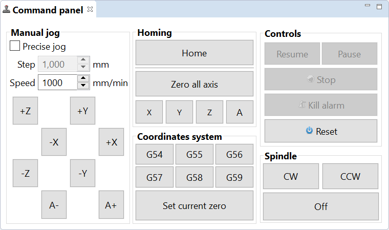

Command panel
=============

The command panel view gives you direct control over your board.

	
It provides most of the basics features for CNC control.

Manual jog:
 :Precise jog: enable/disable precise jog. Precise jog will perform a feedrate linear move 
 :Step: the jog step. Only used when precise jog is active
 :Speed: the jog feedrate
 :+X, -X: jog along the X axis 
 :+Y, -Y: jog along the Y axis 
 :+Z, -Z: jog along the Z axis 
 :+A, -A: jog along the A axis
 
Homing:
 :Home: perform the homing sequence configured for the board
 :Zero all axis: reset the current position to 0 (zero) on all axes. No physical motion will occur. 
 :X, Y, Z, A: reset the current position to 0 (zero) on the labeled axis. No physical motion will occur. 

Coordinates system: 
 :G54 ... G59: switch to the labeled coordinate system. No physical motion will occur. 
 :Set current zero: set the current position as origin for the active coordinate system. No physical motion will occur. 

Controls:
 :Resume: resume the current motion.
 :Pause: pause the current motion.
 :Stop: stop the current motion.
 :Kill alarm: release the board from Alarm state.
 :Reset: soft reset of the board 
 
Spindle:
 :On: turn the spindle On.
 :Off: turn the spindle Off.

.. note:: The provided features are board dependant
