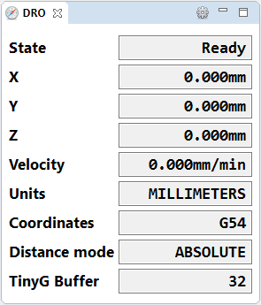
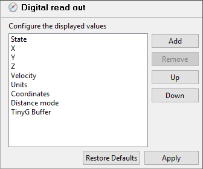

Digital read out
================

The digital read out (aka DRO) part allows to visualize your board state.

You can configure the displayed values it clicking the Settings button in upper right corner of the part, or by using the :menuselection:`Windows --> Preferences`  menu and selecting the *Digital read out* page

.. note:: Available values for display may differ from one board to another
