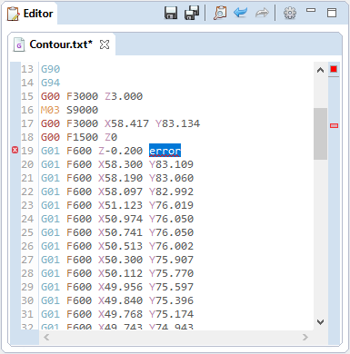
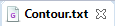
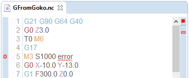
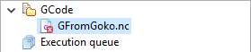

Editor
======

The editor provides useful features for GCode edition.
 * Syntax highlighting,
 * Error notification,
 * Undo and redo,
 * Find and replace,
  

====

Edit GCode
##########

To edit a GCode file, simply right click on the target file in the Workspace tree, and select :guibutton:`Edit source`
The content of the file will be displayed in the Editor pat, ready for modifications.

.. note:: Once saved, changes mades in the editor are immediately visible in the 3D preview of the GCode.

Search
^^^^^^

A search tool is available by clicking the Search icon in the editor toolbar, or by hitting :kbd:`Ctrl + F` in the editor.

====

View final GCode
################

When applying modifiers to a GCode, the resulting program will obviously differ from the source file. To visualise the result of theses modifiers, right click the target file in the Workspace tree, and select :guibutton:`View final`
The computed content will be rendered in the editor in **read only mode**. You won't be able to change the code to avoid conflicts with the applied modifiers.

 
 A read only tab editor

 
 A standard *(write acess)* tab editor
 
====
 
Error visualisation
###################

The editor will highligth words that doesn't match the supported GCode words (see :ref:`gcodesupport`).

 
.. note:: Click on the marker in the right ruler to quickly jump to the line containing the error

GCode containing error will be decorated with a red cross in the Workspace tree.

 
====
 
Editor settings
###############

Editor settings can be accessed by clicking the cog icon in the top right corner of the editor part, or by using the :menuselection:`Windows --> Preferences --> Editor` preferences page.