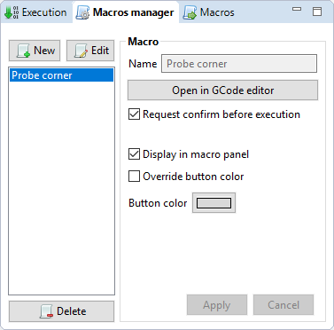
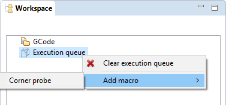

Macro
=====

The macro panel allows to define GCode programs that can be easily reused.

	
====

Macro parameters
################

Macro are created by defining the following properties : 

=================================	================================================================
Parameter							Description
=================================	================================================================
Name								the name of the macro 
Request confirm before execution	used to request a confirmation before the direct execution 
Display in macro panel				used to display an button in the macro execution panel
Override button color				select and chose a color to override the button border color
=================================	================================================================

====

Create a macro
##############

 #. In the **Macros Manager** panel, click the :guibutton:`New` button. A macro is created with a default name, and is ready for edition,
 #. Give your macro a friendly name and adjust the parameters,
 #. Click the :guibutton:`Apply` button to apply and save your changes.
 
====

Edit GCode for a macro
######################
 
The GCode associated with the macro can be changed by clicking the :guibutton:`Open in GCode editor` button. 

It will open the GCode editor and let you edit GCode just like you would do normally. Saving in the editor also saves the content of your macro.

.. note:: Make sure to use GCode supported by your target board

====

Edit a macro
############
 
In the **Macros Manager** panel, select the macro to edit in the list and click the :guibutton:`Edit` button above the list. Fields of the macro will be available for modification. 

Once you're done with modifications, simply click the :guibutton:`Apply` button. To cancel them, click the :guibutton:`Cancel` button.

==== 

Delete a macro
##############
 
In the **Macros Manager** panel, select the macro to delete in the list and click the :guibutton:`Delete` button below the list. 

.. warning:: This operation can not be undone.  

====
 
Execute a macro
###############

A macro can be executed by using one of the following:

 * Click the button in the macro execution panel, if the *Display in macro panel* is activated.

.. image:: images/macro-execution-panel.png
 :align: center

.. warning:: Using this method, the execution of the macro will start **IMMEDIATELY** unless the option :guibutton:`Request confirm before execution` is checked on the given macro.
 
**Or**
 
 * Add it to the execution queue, using the Execution queue contextual menu. It will be executed just like any other GCode file in the execution queue

