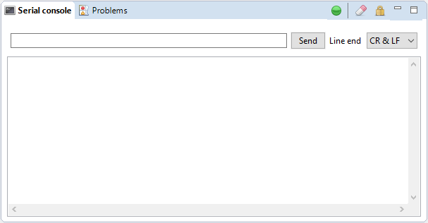

.. _view_serial_console:

Serial console
==============

The serial console displays all data flowing through *(in and out)* the active serial connection. It can also be used to send direct command to the connected serial device.

To send manual commands, simply enter the command in the upper input field and hit Send or press Enter key. The data will be completed with the selected end line character and then transmitted to the connected serial device.

.. warning:: Manually sending data using the Serial Console during the execution of a gcode file is strongly discouraged as it may interfer with the execution process !

====

Serial console filters
######################

Serial console output can be filtered to hide some boring communication between Goko and your board.

The serial filters configuration

.. image:: images/serial-filters.png
	:align: center

Serial filters are defined using the following fields :
 :Description: 
  A user friendly description of the filter

 :Pattern: 
  The pattern used to detect the messages or the parts of a message to hide. This pattern is a standard Java regular expression (see `Oracle documentation <https://docs.oracle.com/javase/8/docs/api/java/util/regex/Pattern.html>`_ for more details)

 :Enabled: 
  Whether or not this filter is active

 :Type: 
  Defines if it's an input, output or bi directional filter. Input filters only apply to message received by Goko from the board. Output filters apply to messages from Goko to the board. Input & output filters apply to both cases.

.. note:: Serial filter only prevents the message from being displayed in the console. They are normally received and processed by any other process in Goko.

**Useful filters**

=========================== ========= =========
Description                 Pattern   Type
=========================== ========= =========
GRBL Status filter          <.*>      Input
GRBL Status request filter  \?        Output
=========================== ========= =========

See also:
 * :ref:`connecting`