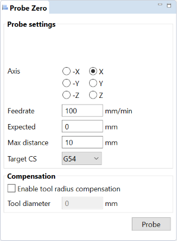

Zero Probe
==========

This tool allows to detect the edge of a piece and adjust the offset to it, by taking into account the tool radius. 

.. note:: The use of this tool requires a probing device as well as a probing capable board (TinyG, Grbl...)

	
	
Probe settings:
 :Axis: the axis and direction toward which to probe 
 :Feedrate: the desired probe feedrate
 :Expected: the position to set when touch occurs. Use 0 to automattically zero the desired coordinate system.
 :Max distance: the maximum probing distance. If no contact occurs within this distance, starting from the current location, then probing will fail and coordinate offset won't be updated.
 :Target CS: the target coordinate system to update
 
Compensation:
 :Tool diameter: the tool diameter. If activated compensation will offset the expected location with half the diameter of the tool, in the opposite direction of the probe axis